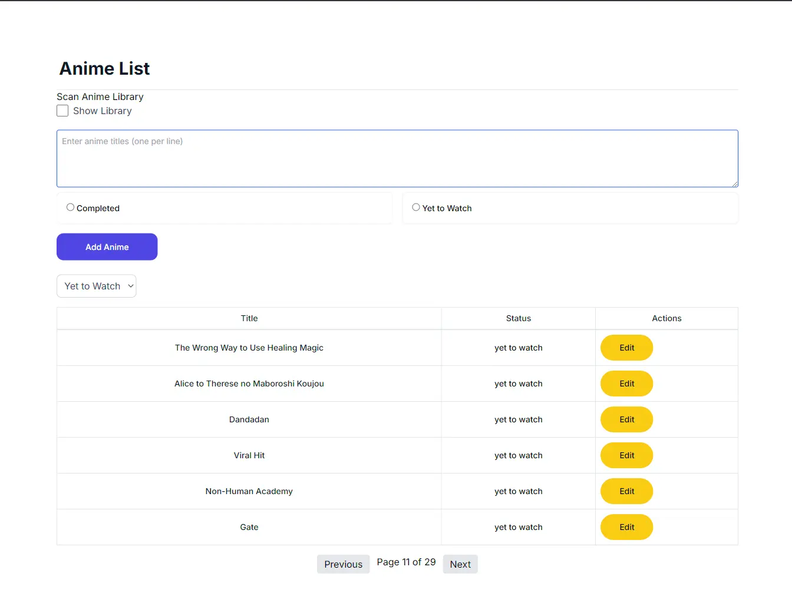
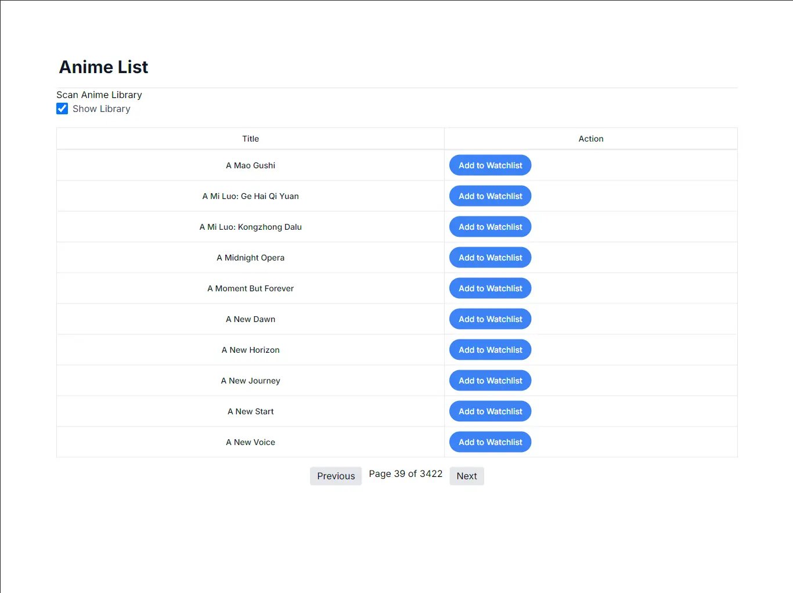

# Anime Watch List Tracker

Welcome to the Anime Watch List Tracker! This project is built using **Bun**, **Elysia**, **Next.js**, and **SQLite**. It allows you to manage your anime watch list with ease, tracking the anime titles you plan to watch, are currently watching, or have completed.

## Features

- **Add Anime Titles**: Easily add new anime titles to your watch list.
- **Track Progress**: Keep track of the anime you're currently watching, have completed, or plan to watch.
- **Huge Anime Library**: Easily find your anime from Huge Library or Add your Own List.
- **SQLite Database**: All data is stored in a lightweight SQLite database.
- **Bun & Elysia Backend**: Fast and efficient server-side operations with Bun and Elysia.
- **Next.js Frontend**: Responsive and interactive user interface with Next.js.

## Installation

### Prerequisites

- **Bun**: Ensure you have Bun installed. You can install it by following the instructions [here](https://bun.sh/).

### Steps

1. **Clone the Repository**

   ```bash
   git clone https://github.com/Shaunfurtado/AniWaList.git
   cd AniWaList
   ```

2. **Install Dependencies**

   ```bash
   bun install
   cd frontend
   bun install
   ```

3. **Set Up the Database**

   The database is managed with SQLite and should be set up automatically when you start the backend server.

4. **Start the Backend Server**

   ```bash
   bun dev
   ```

5. **Start the Frontend Development Server**

   ```bash
   bun start
   ```

6. **Access the Application**

   Open your browser and navigate to `http://localhost:3000` to start managing your anime watch list.

## Usage

1. **Adding an Anime**

   - Click on the "Add Anime" button.
   - Enter the title and other details.
   - Click "Save" to add it to your watch list.

2. **Viewing Your Watch List**

   - Navigate through the different sections (Yet To Watch, Completed) to see your anime list.

3. **Updating Status**

   - Click on an anime title to view details and update its status.

## Screenshots




## Contributing

Contributions are welcome! Please feel free to submit a pull request or open an issue if you have any suggestions or improvements.
